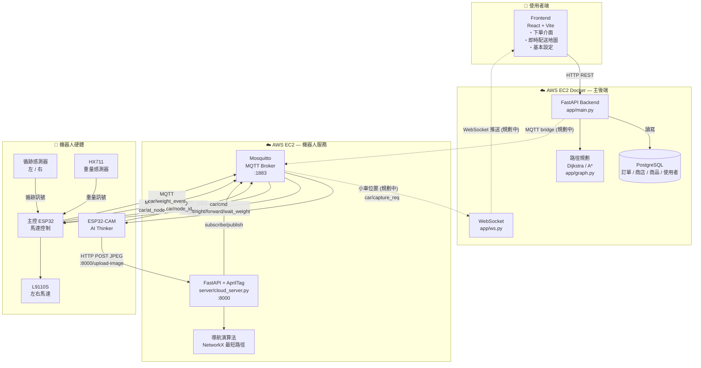
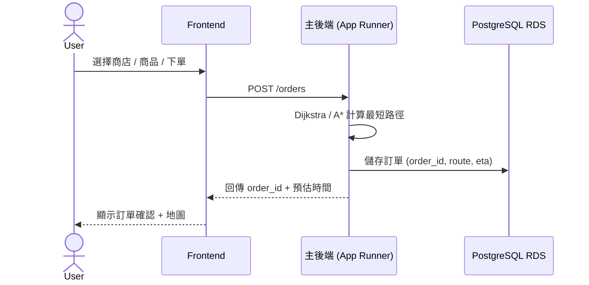
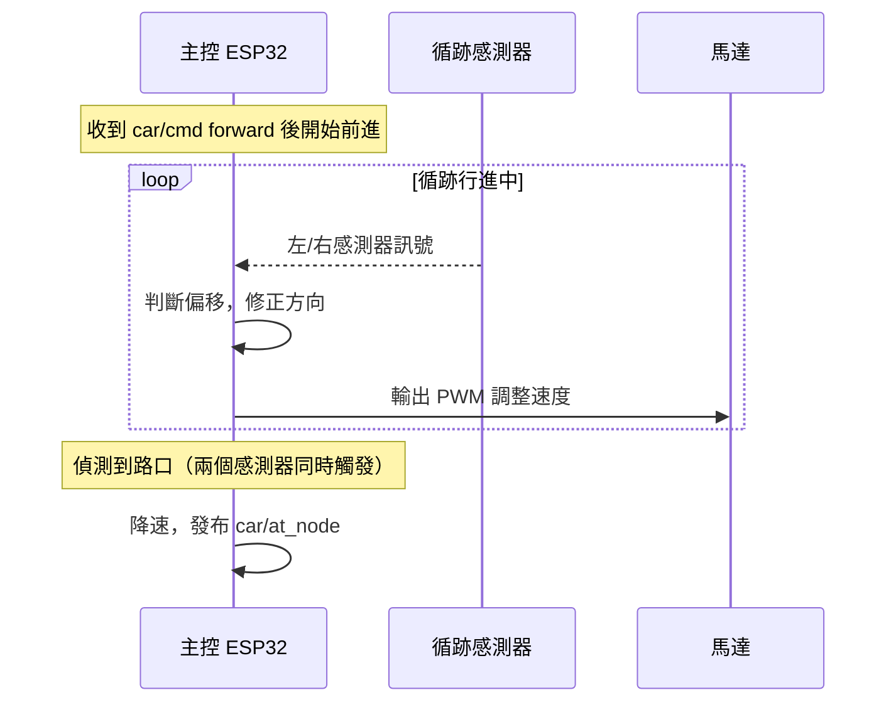
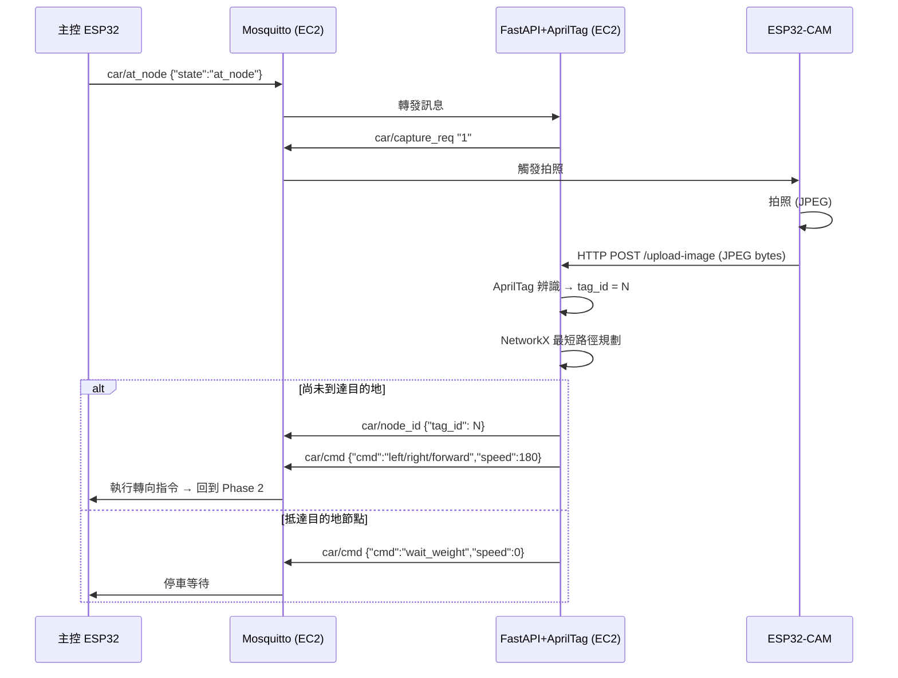
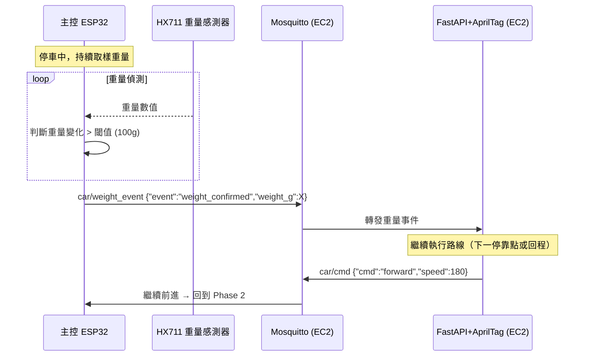

# GDG 2026 自主送餐機器人 — 完整系統架構

## 系統架構總覽

---

## 完整運作流程

### Phase 1：使用者下單

---

### Phase 2：機器人循跡前進（路口之間）

---

### Phase 3：路口辨識 → 取得下一步指令

---

### Phase 4：停靠點取餐 → 繼續路線

---

## MQTT Topic 對照表

| Topic | 發布者 | 訂閱者 | 說明 |
|---|---|---|---|
| `car/cam_ip` | ESP32-CAM | FastAPI | 相機開機 IP (retained) |
| `car/at_node` | 主控 ESP32 | FastAPI | 偵測到路口通知 |
| `car/capture_req` | FastAPI | ESP32-CAM | 觸發拍照 |
| `car/node_id` | FastAPI | 主控 ESP32 | AprilTag 辨識結果 |
| `car/cmd` | FastAPI | 主控 ESP32 | 行進指令 (left/right/forward/wait_weight) |
| `car/weight_event` | 主控 ESP32 | FastAPI | 重量變化確認 |

---

## 各服務部署位置

> 所有後端服務皆以 Docker 容器方式部署於同一台 AWS EC2 (`t3.small`, 2 vCPU / 2GB RAM, ap-southeast-2, IP: `3.27.165.128`)，以 `docker-compose` 統一管理。

| 服務 | 技術 | 部署位置 | Port |
|---|---|---|---|
| Frontend | React + Vite (Nginx) | Docker — AWS EC2 (3.27.165.128) | 80 |
| 主後端 | FastAPI + SQLAlchemy | Docker — AWS EC2 (3.27.165.128) | 8001 |
| 資料庫 | PostgreSQL | Docker — AWS EC2 (3.27.165.128) | 5432 |
| MQTT Broker | Eclipse Mosquitto | Docker — AWS EC2 (3.27.165.128) | 1883 |
| 機器人服務 | FastAPI + AprilTag | Docker — AWS EC2 (3.27.165.128) | 8000 |
| ESP32-CAM | Arduino C++ | 機器人本體 | WiFi |
| 主控 ESP32 | Arduino C++ | 機器人本體 | WiFi |

### 預估資源使用 (t3.small)

| 服務 | 估計 RAM |
|---|---|
| Nginx (Frontend) | ~50 MB |
| FastAPI 主後端 | ~200 MB |
| PostgreSQL | ~200 MB |
| Mosquitto | ~20 MB |
| 機器人服務 (AprilTag + OpenCV) | ~400 MB |
| OS + Docker overhead | ~300 MB |
| **合計** | **~1.2 GB / 2 GB** |

---

## ⚠️ 已知 Bug 需修正

| 問題 | 說明 |
|---|---|
| Topic 不一致 | `cloud_server.py` 發布 `car/node_id`，主控韌體訂閱 `car/node_update`，需統一 |

---

## 目前狀態

| 模組 | 狀態 |
|---|---|
| ESP32-CAM ↔ EC2 MQTT | ✅ 完成 |
| ESP32-CAM 拍照上傳 | ✅ 完成 |
| EC2 AprilTag 辨識 | ✅ 完成（需調整實體環境）|
| EC2 路徑規劃 | ✅ 完成 |
| 主後端 API + RDS | ✅ 完成 |
| 主後端 ↔ EC2 MQTT 整合 | ⚠️ 規劃中（目前 Mock）|
| WebSocket 推送小車位置 | ⚠️ 規劃中 |
| 主控 ESP32 燒錄雲端 config | ⏳ 待完成 |
| 實體測試 | ⏳ 待完成 |
